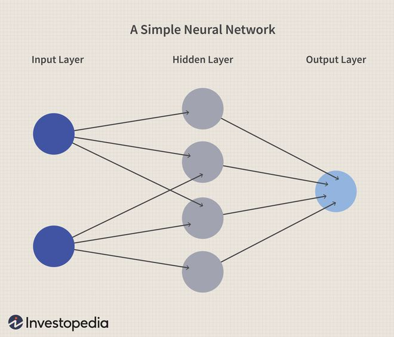

---

marp: true
author: Amezcua Josue
size: 4:3
theme: gaia

---

# Bienvenidos a Markdown
## Subtitulo 
### Subsubtitulo
#### subsubsubtitulo
##### nivel 5

Esto es texto plano y puedo escribir un parrafo.

---

# Listas / Viñetas
- Viñeta 1
- Viñeta 2
    - Viñeta 2.1
    - **negritas**
    - *italicas*
    - ~~tachado~~ 
    - `quoted`
---
# Red neuronal

:max_bytes(150000):strip_icc()/dotdash_Final_Neural_Network_Apr_2020-01-5f4088dfda4c49d99a4d927c9a3a5ba0.jpg)

---

# Red neuronal
:max_bytes(150000):strip_icc()/dotdash_Final_Neural_Network_Apr_2020-01-5f4088dfda4c49d99a4d927c9a3a5ba0.jpg)

---

# Red neuronal

---

# Hipervinculos

<https://www.unam.mx>
<correo@dominio.com>

Yo asisto a la [FI](http://www.fi-b.unam.mx/)
* Exportar a pdf y a powerpoint para ver las diferencias
---

# Tabla

|Tit 1|Tit 2|Tit 3|
|---|---|---|
|info 1|info 2|info 3|
|celda 1|celda 2|celda 3|