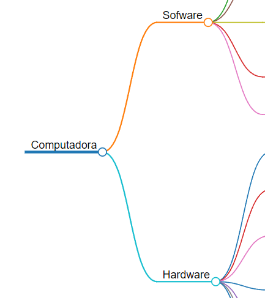

---

marp: true
author: Amezcua Josue
size: 4:3
theme: gaia

---
# Tutorial de como usar:
### Marp
### Markmap
### PlantUML Previewer
#### Por: Josue Amezcua
---
## Markmap
Marp es la forma grafica más facil de trabajar a mi parecer puesto que solo necesitamos conocer la sintaxis que es super sencilla ya que todo depende de como usemos "#".

#### Ejemplo:
La cantidad de "#" nos ayuda a darle esa jerarquia que lo caracteriza, asi que quedaría de la siguiente manera:

---
_# Computadoras
_## Sofware
_## Hardware

---

De esa manera entre más "#" agreguemos más subramas tendremos

---

## Marp

Para comenzar estos ejemplos ya se están haciendo en Marp que es como una forma de hacer presentaciones estilo PowerPoint pero con su toque de programación como si fuera HTML o algo por el estilo.

---

#### Ejemplo:
para comenzar tenemos claro que siempre debemos marcar un inicio y un fin dentro de nuestros codigos, esto lo hacemos poniendo primero "---" al inicio antes que cualquier texto y al fianl de cada "pagina" de nuestra presentación que tendremos, en la primera sección tendremos que poner marp: true y nos quedaria de la siguiente manera:
marp: true
author: Amezcua Josue <- tu nombre
size: 4:3 <- tamaño de la plantilla
theme: gaia <- Color de la plantilla

---

Claro que todo esto iría entre "---" para que pueda funcionar correctamente y de ahí usariamos los "#" para poder establecer encabezados de distintos tamaños, y de alguna manera darle un mejor formato, tambien podemos ~~subrayar~~ palabras, ponerlas en **negritas**, *etc*.
Al final podremos importar esta presentación como un PDF para mayor practicidad.

---
## PlantUML

Plant UML nos ayuda a obtener los cuadros de nuestras clases asi como sus niveles de acceso y métodos, lo hace de manera grafica, pero para ello nosotros debemos escribir el código tal cual como si lo quisieramos programar, en este caso debermos poner los atributos dentro de su clase perteneciente, pero digamos que tenemos un atributo private llamado dinero, el cual es float, por lo cual su sintaxis sería así "-dinero:float", para los métodos es bastante similar en este caso si tuvieramos uno de retirar sería "+Retirar()".

---

Una sintaxis muy simple pero efectiva por lo cual tenemos muchas posibilidades al poder obtener esta "traducción" de nuestro código a una manera más gráfica

